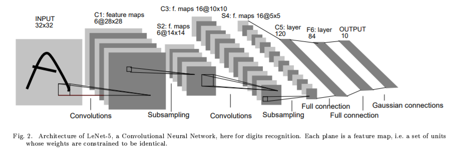

### CIFAR-10上训练LeNet5模型
## 环境
* pytorch==1.7.1
* python==3.7.3
* torchvision==0.8.2
* torchsummary==1.5.1

## 网络结构
* LeNet-5结构源自论文[Gradient-Based Learning Applied to Document Recognition](http://yann.lecun.com/exdb/publis/pdf/lecun-01a.pdf) 
* 本文中使用MaxPooling2d代替Subsampling.
